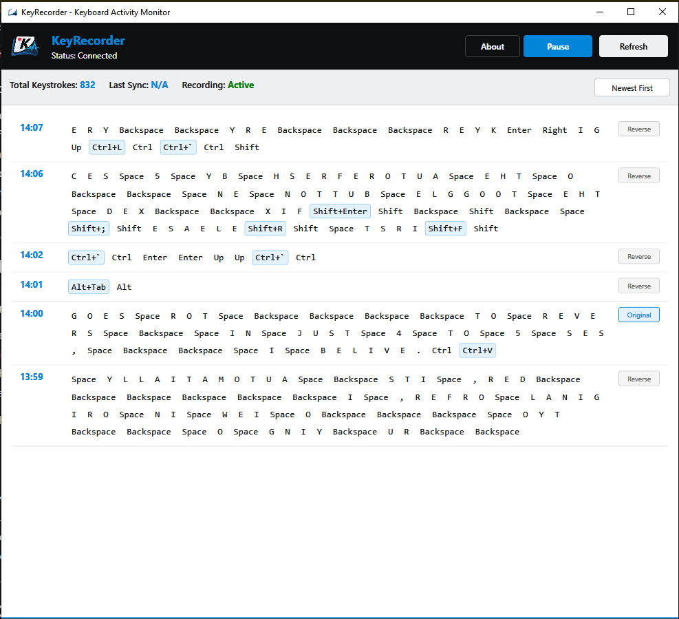

<div align="center">
  

  <h3>Your Personal Keyboard Activity Monitor</h3>

  <p>Track your typing patterns, debug workflows, and boost productivity with local-only keyboard monitoring.</p>

  
  
  
  
</div>

---

## 🎯 Why KeyRecorder?

Ever wondered where your typing time goes? Need to debug a workflow? Want to analyze your keyboard usage patterns?

**KeyRecorder** helps you:

- 📊 **Track Productivity** - See exactly how much time you spend typing in different applications
- 🐛 **Debug Workflows** - Replay your exact keystrokes to identify where things went wrong
- ⏱️ **Time Tracking** - Automatically log active work hours based on keyboard activity
- 📝 **Writing Analysis** - Understand your writing patterns and typing speed
- 🔍 **Activity Review** - Search through your typing history to recover forgotten text
- 💡 **Habit Building** - Monitor your keyboard shortcuts usage and improve efficiency

### 100% Private

All data stays on **your machine**. No cloud sync, no telemetry, no network access. Your keystrokes never leave your computer.

---

## ✨ Key Features

### For Everyone

- 🔄 **24/7 Background Recording** - Runs as a Windows Service, always capturing your keystrokes
- 📱 **Clean, Modern UI** - View your typing history in an intuitive timeline interface
- ⏸️ **Pause/Resume** - Full control over when recording is active
- 🗓️ **Smart Retention** - Keep 7-365 days of history with automatic cleanup
- 🔒 **Secure & Private** - All data encrypted and stored locally on your machine
- 💾 **Crash-Proof** - Triple-database architecture with automatic recovery

### For Developers & Power Users

- 🏗️ **Triple Database** - Hot, Main, and Snapshot databases for reliability
- 🔧 **Configurable** - Customize retention policies, sync intervals, and more
- 🚀 **High Performance** - <1% CPU usage, <100MB RAM, <5ms capture latency
- 🛡️ **Named Pipes IPC** - Secure communication between service and UI
- 📦 **SQLite Storage** - Industry-standard database with WAL mode
- 🔄 **Auto-Recovery** - Automatic integrity checks and snapshot restoration

---

## 🚀 Quick Start

### Installation (1 minute)

1. **Download** [`KeyRecorderSetup.exe`](../../releases) from the latest release
2. **Right-click** → "Run as Administrator"
3. **Follow** the installation wizard
4. **Done!** Launch KeyRecorder from Start Menu

The installer handles everything automatically - service installation, database setup, and shortcuts.

### First Use

<div align="center">
  
</div>

1. **Launch** KeyRecorder UI from your Start Menu or Desktop
2. **View** your keystroke timeline organized by minute
3. **Pause/Resume** recording with the button in the header
4. **Click About** to learn more about the application

---

## 📖 Use Cases

### 1. **Productivity Tracking**
Monitor how much time you spend actively typing in different applications. Identify time-wasting patterns and optimize your workflow.

### 2. **Developer Debugging**
Replay exact keystroke sequences that led to a bug. Perfect for troubleshooting complex terminal commands or IDE shortcuts.

### 3. **Writing & Content Creation**
Analyze your writing patterns, typing speed, and most-used keys. Track progress on writing projects over time.

### 4. **Time Logging**
Automatically record when you're actively working based on keyboard activity. Great for freelancers and consultants.

### 5. **Learning & Habit Formation**
Monitor your keyboard shortcut usage and identify areas for improvement. Build better typing habits.

### 6. **Text Recovery**
Accidentally closed a document without saving? Search your keystroke history to recover the text.

---

## ⚙️ Configuration

Customize KeyRecorder to your needs:

**Location:** `C:\Program Files\KeyRecorder\appsettings.json`

```json
{
  "DatabasePath": "C:\\ProgramData\\KeyRecorder",
  "SyncIntervalMinutes": 5,
  "IntegrityCheckIntervalMinutes": 60,
  "RetentionDays": 7
}
```

**Options:**
- `RetentionDays` - How long to keep history (7-365 days)
- `SyncIntervalMinutes` - How often to save to disk (1-60 minutes)
- `DatabasePath` - Where to store keystroke data

After changing settings, restart the service:
```powershell
Restart-Service "KeyRecorder Service"
```

---

## 🔒 Privacy & Security

### Your Data is Yours

- ✅ **100% Local** - No cloud, no network, no telemetry
- ✅ **Encrypted Storage** - SQLite databases with secure file permissions
- ✅ **User Control** - Pause/resume at any time
- ✅ **Transparent** - Open source, inspect the code yourself

### Database Location

All keystroke data is stored at:
```
C:\ProgramData\KeyRecorder\
├── keyrecorder_hot.db      # Live capture buffer
├── keyrecorder_main.db     # Historical data
└── keyrecorder_snapshot_*  # Automatic backups
```

You can **back up**, **delete**, or **move** these files anytime.

---

## 🛠️ System Requirements

- **OS:** Windows 10 or Windows 11
- **Runtime:** .NET 10 Runtime ([Download](https://dotnet.microsoft.com/download/dotnet/10.0))
- **Permissions:** Administrator (for service installation only)
- **Disk Space:** ~50MB for application, varies for data

---

## 🗑️ Uninstallation

**Via Settings:**
1. Settings → Apps → KeyRecorder → Uninstall
2. Choose whether to keep or delete your keystroke data

**Via Uninstaller:**
```powershell
"C:\Program Files\KeyRecorder\unins000.exe"
```

Your data is preserved unless you explicitly choose to delete it.

---

## 🤝 Contributing

KeyRecorder is **open source** and welcomes contributions!

### For Developers

#### Getting Started

1. **Clone the repository**
   ```bash
   git clone https://github.com/yourusername/keyrecorder.git
   cd keyrecorder
   ```

2. **Install prerequisites**
   - [.NET 10 SDK](https://dotnet.microsoft.com/download/dotnet/10.0)
   - [Visual Studio 2022](https://visualstudio.microsoft.com/) or [VS Code](https://code.visualstudio.com/)

3. **Build the solution**
   ```powershell
   dotnet build KeyRecorder.slnx
   ```

4. **Run the application**
   ```powershell
   # Service (as console app for testing)
   dotnet run --project KeyRecorder.Service

   # UI
   dotnet run --project KeyRecorder.UI
   ```

#### Project Structure

```
KeyRecorder/
├── KeyRecorder.Core/        # Shared library
│   ├── Capture/             # Keyboard hook (Win32 API)
│   ├── Data/                # SQLite database layer
│   ├── IPC/                 # Named Pipes communication
│   └── Models/              # Data models
├── KeyRecorder.Service/     # Windows Service
│   └── KeyRecorderWorker.cs # Background service logic
├── KeyRecorder.UI/          # WPF Application
│   └── MainWindow.xaml      # Main UI window
└── Installer/               # Inno Setup installer
```

#### Areas for Contribution

We welcome contributions in these areas:

- 🎨 **UI/UX Improvements** - Better visualization, charts, heatmaps
- 🚀 **Performance** - Optimize database queries and memory usage
- 📊 **Analytics** - Add statistics, graphs, and insights
- 🔍 **Search** - Improve keystroke search and filtering
- 🌐 **Localization** - Translate to other languages
- 📝 **Documentation** - Improve guides and tutorials
- 🐛 **Bug Fixes** - Find and fix issues
- ✨ **New Features** - Export to CSV/JSON, application-specific timelines, etc.

#### Development Workflow

1. **Fork** the repository
2. **Create** a feature branch (`git checkout -b feature/amazing-feature`)
3. **Make** your changes
4. **Test** thoroughly
5. **Commit** with clear messages (`git commit -m 'Add amazing feature'`)
6. **Push** to your fork (`git push origin feature/amazing-feature`)
7. **Open** a Pull Request

#### Code Style

- Follow C# naming conventions
- Use meaningful variable and method names
- Add XML documentation comments for public APIs
- Keep methods focused and small
- Write unit tests for new features

#### Building the Installer

To create the installer package:

```powershell
.\build-installer.bat
```

**Requirements:**
- [Inno Setup 6.x](https://jrsoftware.org/isdl.php) - The build script can download and install this automatically if not found
- .NET 10 SDK

**Output:** `Installer\KeyRecorderSetup.exe`

The build script will automatically:
- Detect if Inno Setup is installed
- Offer to download and install Inno Setup if not found
- Build all projects in Release mode
- Create the installer package

See [BUILD_INSTALLER.md](BUILD_INSTALLER.md) for detailed instructions.

---

## 📚 Documentation

- [Quick Start Guide](QUICKSTART.md) - Get up and running in 5 minutes
- [Building the Installer](BUILD_INSTALLER.md) - Create your own installer
- [Branding Guide](BRANDING.md) - Logo usage and color palette
- [Architecture Overview](Requirements.md) - Detailed system design

---

## 🐛 Troubleshooting

### Service Won't Start

**Check Event Viewer:**
```powershell
Get-EventLog -LogName Application -Source "KeyRecorder Service" -Newest 10
```

**Verify .NET Runtime:**
```powershell
dotnet --version
```

### UI Can't Connect

**Check service status:**
```powershell
Get-Service "KeyRecorder Service"
```

**Restart if needed:**
```powershell
Restart-Service "KeyRecorder Service"
```

### More Help

- 📖 Check our [documentation](docs/)
- 💬 Ask questions in [Discussions](../../discussions)
- 🐛 Report bugs in [Issues](../../issues)

---

## 📊 Technical Details

### Architecture

```
┌─────────────────────────────────────────┐
│   Windows Service (Background)          │
│   - Global Keyboard Hook                │
│   - SQLite Database (Hot/Main/Snapshot) │
│   - IPC Server (Named Pipes)            │
│   - Background Jobs (Sync/Integrity)    │
└──────────────┬──────────────────────────┘
               │ Named Pipes (IPC)
┌──────────────┴──────────────────────────┐
│   WPF UI (User Interface)               │
│   - Real-time Keystroke Display         │
│   - Time-based Grouping                 │
│   - Pause/Resume Controls               │
│   - Statistics Dashboard                │
└─────────────────────────────────────────┘
```

### Performance

- **CPU Usage:** <1% when idle
- **Memory:** ~50-100 MB for service
- **Capture Latency:** <5ms per keystroke
- **Disk I/O:** Minimal (WAL mode for efficient writes)

### Data Flow

1. **Capture** - Low-level keyboard hook captures every keystroke
2. **Buffer** - Keystrokes written to Hot Database immediately
3. **Sync** - Every 5 minutes, Hot → Main database transfer
4. **Integrity** - Hourly checks with automatic recovery
5. **Snapshot** - Hourly backups of main database
6. **Retention** - Automatic cleanup of old data
7. **Display** - UI queries main database for visualization

---

## ⚖️ Legal & Responsible Use

### MIT License

This software is open source under the MIT License. See [LICENSE](LICENSE) for details.

### Responsible Use

**✅ Appropriate Uses:**
- Personal productivity tracking
- Debugging your own workflows
- Educational and research purposes
- Time tracking for your own work

**❌ Prohibited Uses:**
- Unauthorized monitoring of others
- Employee surveillance without consent
- Violating privacy laws or regulations
- Circumventing security measures

### Legal Compliance

**Always ensure:**
- ✓ You have consent to monitor (if monitoring others)
- ✓ Compliance with GDPR, CCPA, and local privacy laws
- ✓ Compliance with employment and labor laws
- ✓ Transparency about monitoring practices

**The authors are not responsible for misuse of this software.**

---

## 🌟 Support the Project

If KeyRecorder helps you, consider:

- ⭐ **Star** this repository
- 🐛 **Report** bugs and suggest features
- 💻 **Contribute** code or documentation
- 📢 **Share** with others who might find it useful
- ☕ **Sponsor** the project (coming soon)

---

## 📬 Contact

- **Issues:** [GitHub Issues](../../issues)
- **Discussions:** [GitHub Discussions](../../discussions)
- **Security:** Report security issues privately (see [SECURITY.md](SECURITY.md))

---

<div align="center">
  <p>Made with ❤️ by the KeyRecorder community</p>
  <p>
    <a href="LICENSE">License</a> •
    <a href="QUICKSTART.md">Quick Start</a> •
    <a href="../../releases">Download</a> •
    <a href="../../issues">Report Bug</a> •
    <a href="../../discussions">Discussions</a>
  </p>
</div>
